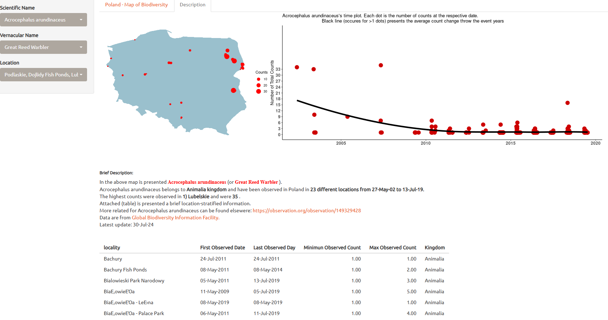

# **🌿 R Shiny - Biodiversity dashboard (2021)** 

🎯 ***Aim***: Build a Shiny app that visualizes Poland’s observed species on the map and their frequency.  
The purpose of this repository is **solely** to explore and become familiar with R Shiny and its functionality.   
⚠️ **No scientific insights or conclusions are provided.**

## Project Structure

### Table of Contents
1. 🔍 **[ Dataset](#dataset)** - Data source
2. 🧹 **[ Data Processing](#data-processing)** - Cleaning and feature engineering
3. 📊 **[ Shiny App](#Shiny-app)** - App description of functionality
4. ▶️ **[ Executing the Application](#Executing-the-Application)** - App execution
5. 🔁 **[ Reproducibility](#Reproducibility)** - Reproducibility steps
6. 📦 **[ Requirements](#Requirements)** - Install dependencies

## 🔍 Dataset 
GBIF — the [🌐 Global Biodiversity Information Facility](https://www.gbif.org/dataset/search?q=) —  
is an international network and data infrastructure, aimed at providing open access on biodiversity data globally.
- [📥 *Download Source*](https://drive.google.com/file/d/1l1ymMg-K_xLriFv1b8MgddH851d6n2sU/view)

## 🧹Data Processing
1. **Data Cleaning**:  
- Removed duplicate rows (identical scientific name, latitude, longitude, and event date)
- Handled missing values
- Clean string features and remove unnecessary features  
2. **Feature Engineering**: Created vectors for the shinyapp
 
## 📊 Shiny app

### 🔧 Description of Functionality

#### First Tab: Interactive Map
  

The first tab displays an interactive map displaying the geographical distribution of various species across Poland,
allowing users to explore biodiversity patterns spatially.  
Users can search for species using their Scientific Name or Vernacular Name.  
After selecting a species, the map displays its observation points along with detailed location information.

#### Second Tab: Species Summary
  

Users can select specific species by either their Scientific Name or Vernacular Name to view a brief description, including:  
- Scientific and vernacular names
- Observation timelines
- Occurrences
- Locations
- Event dates
- Associated kingdom
- URLs for deeper information  
Additionally:  
A summary table provides a location-specific detailed information on these attributes for the selected species.  
A small map of Poland highlights species observations, with dot sizes proportional to the count of occurrences.  
A time plot illustrates how the total number of occurrences varies over time.

## ▶️ Executing the Application
The app is hosted on [shinyapps.io](https://cpapagiannopoulos.shinyapps.io/Poland_biodiversity/) 

## 🔁 Reproducibility
1) Clone the repo and download the [biodiversity data](https://drive.google.com/file/d/1l1ymMg-K_xLriFv1b8MgddH851d6n2sU/view)  
2) Align the code with the path where the biodiversity data exists  
3) Run the requirements.R

## 📦 Requirements
- Before running the Shiny app.R, run the requirements script to install all necessary libraries  
- R version: 4.4.1 (2024-06-14 ucrt)
